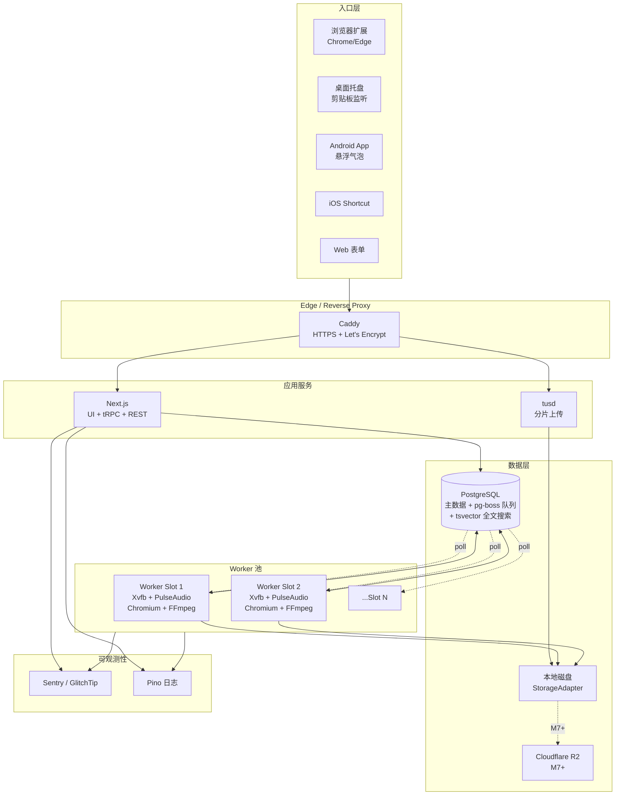
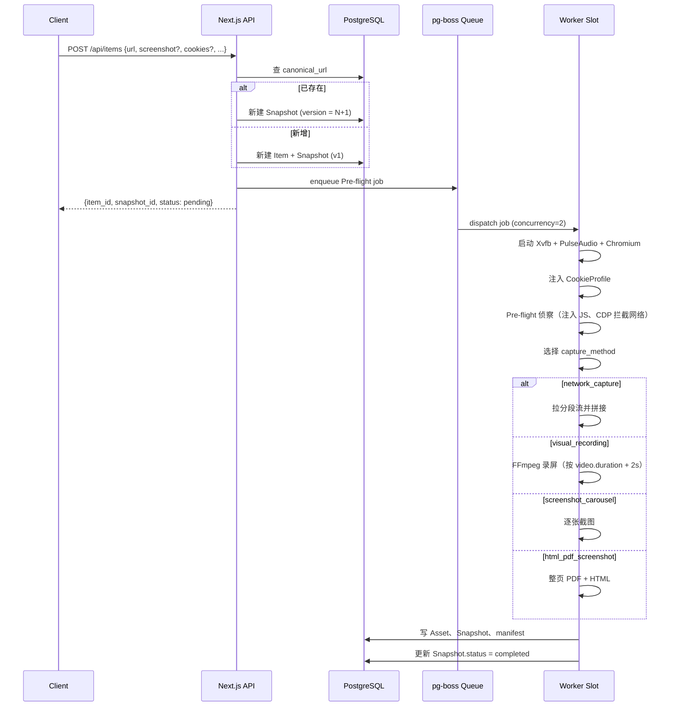
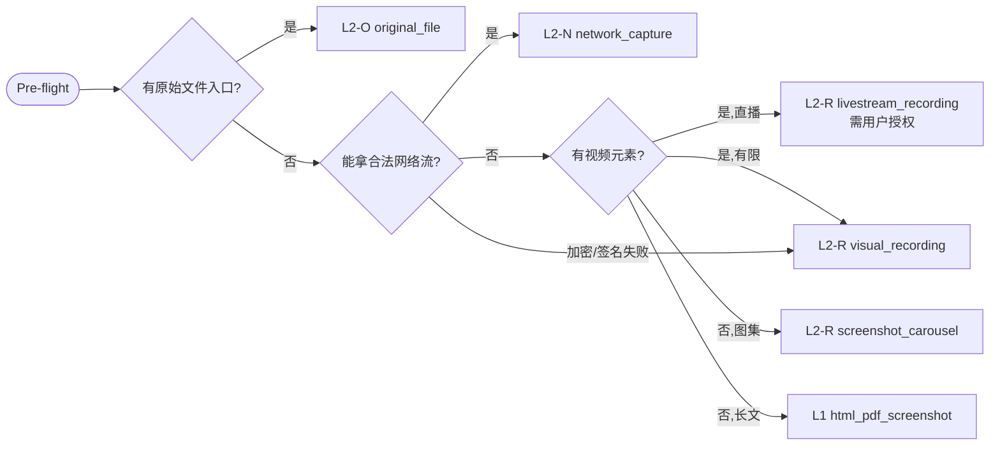
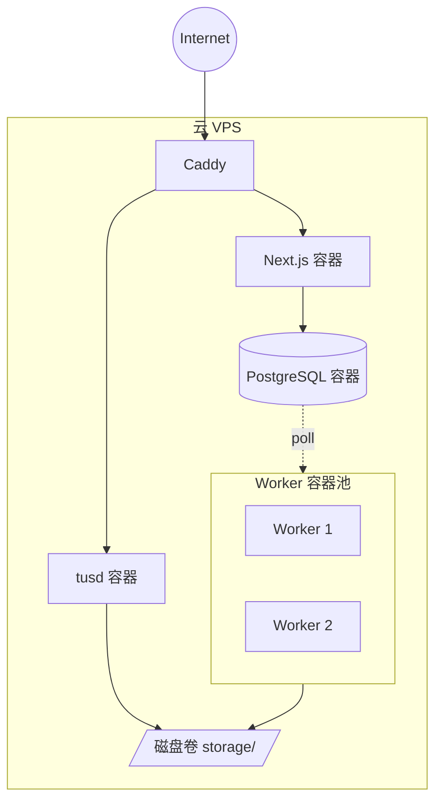

# Architecture

PersonalMediaArchive 的系统架构当前快照。本文档与代码同源演进，每次架构变更必须同步更新本文档并附 ADR。

详细规划与设计原则见 [README.md](./README.md)。本文档侧重 **当前实际架构** 与 **模块边界**。

---

## 系统全景



---

## 模块边界

```text
apps/                 （M1.2 起填实）
  web/                Next.js 前端 + API（tRPC + REST 兼容端点）
  worker/             pg-boss worker 池

packages/
  db/                 ✅ Drizzle schema、迁移、查询、seed（M1.1 已就位）
  shared/             ✅ 错误码、版本常量（M1.0 占位，M1.3 起加 tRPC 路由签名）
  capture/            （M2）Playwright 控制、CDP 拦截、Pre-flight 侦察
  recording/          （M2）Xvfb/PulseAudio/FFmpeg 编排
  storage/            （M2）StorageAdapter 接口 + LocalDiskAdapter + R2Adapter
  vault/              （M4）Cookie Vault（AES-GCM 加密、注入）
  search/             （MVP2）全文搜索（tsvector），扩展 pgvector

extensions/           （M5）
  chrome-edge/        Chrome/Edge MV3 扩展

docs/                 ADR、ops runbook
.github/              CI、Issue/PR 模板
drizzle/              packages/db/drizzle 下的 SQL 迁移
docker-compose.yml    本地开发 + 生产部署的服务编排
```

**严禁跨模块**：`apps/web` 不直接 import `packages/capture`；走 tRPC + Job。`packages/recording` 不直接读写 DB；通过 `packages/db` 提供的 repository 接口。

---

## 数据流

### 提交一条 URL



### 归档等级选择



详见 [ADR-0002](./docs/adr/0002-archive-levels.md) 与 [ADR-0003](./docs/adr/0003-capture-priority-strategy.md)。

---

## 部署拓扑（MVP1）



服务清单（Docker Compose）：

```text
caddy        反代 + HTTPS
web          Next.js（UI + API）
tusd         分片上传
worker       Worker（横向复制到 concurrency 数）
postgres     主数据 + 队列
```

M7 后增 R2 适配器，本地磁盘转为缓冲层。

---

## 关键非功能特性

| 维度 | 当前目标 |
|---|---|
| 并发录制 | 默认 2，由 `WORKER_CONCURRENCY` 控制 |
| 单录制时长上限 | 30 分钟硬上限；按 `video.duration + 2s` 自适应 |
| 上传文件大小上限 | tus 分片，理论无上限；硬限 5GB（单 snapshot） |
| 服务等级 | 个人项目，无 SLA；备份是关键 |
| 备份频率 | DB 每日逻辑备份，资产文件持续同步至 R2（M7+） |
| 数据加密 | Cookies 表 AES-GCM；HTTPS in transit；磁盘静态依靠 VPS 提供 |

---

## 演进规则

1. 任何**新增模块**、**修改模块边界**、**替换核心依赖**必须先写 ADR
2. 本文档的 Mermaid 图必须随之更新
3. ADR 编号顺序追加（不重用、不修改已 accepted 的）
4. 跨模块的数据流变化需更新本文档 §数据流
5. 部署拓扑变化需同步 `docs/ops/deploy.md`

历史决策见 `docs/adr/`。
